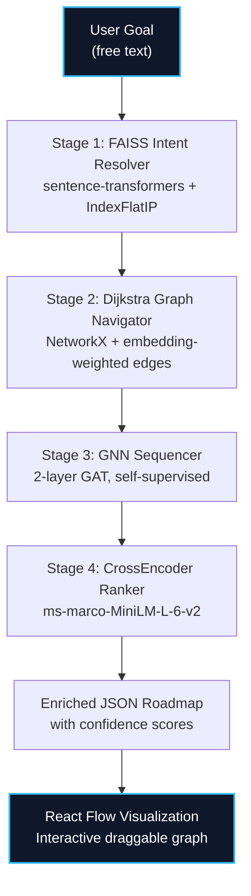

# AI Learning Architect: The AI/ML Deep-Dive

> **Version 2.0 — PathInferenceEngine Architecture**
> A 100% model-driven system. Every decision that can be made by a model instead of an `if` statement, is made by a model.

---

## What This Project Does

The AI Learning Architect takes a vague, unstructured career goal like *"I want to learn deep learning and neural networks"* and produces a **personalized, optimally-sequenced learning roadmap** with embedded YouTube tutorials — all dynamically generated by a chain of ML models with zero hardcoded paths.

**Input:** A free-text goal + a list of skills the user already knows.
**Output:** An interactive, draggable graph visualization of learning steps — each node containing a GNN-predicted priority, a readiness score, and a Cross-Encoder-ranked YouTube tutorial.

---

## The 5-Model ML Stack

This is not a simple CRUD app. Every layer of the pipeline uses a different ML technique to solve its specific sub-problem:

| Layer | Model / Algorithm | What It Solves |
|:---|:---|:---|
| **1. Intent Resolution** | `all-MiniLM-L6-v2` Sentence Transformer + FAISS Inner-Product Index | Understanding *what* the user wants from vague text |
| **2. Graph Navigation** | NetworkX Dijkstra with embedding-weighted edges | Finding the *cheapest cognitive path* through prerequisites |
| **3. Sequencing** | 2-layer Graph Attention Network (GAT) in pure PyTorch | Predicting *what to learn next* and priority classification |
| **4. Resource Ranking** | `ms-marco-MiniLM-L-6-v2` Cross-Encoder | Selecting the *most relevant* YouTube tutorial from candidates |
| **5. Orchestration** | LangGraph StateGraph (4-stage pipeline) | Managing deterministic, inspectable stage transitions |

---

## Full Pipeline Architecture



---

## 🧠 The AI Core Subsystems (Deep-Dives)

### [1. NLP & Semantic Intent Parsing](docs/aiml/NLP_SEMANTIC_INTENT.md)
How `all-MiniLM-L6-v2` encodes vague goals like *"I want to hack stuff"* into 384-dimensional vectors, and how FAISS `IndexFlatIP` resolves them to curriculum nodes in sub-millisecond time via cosine similarity.

### [2. Vector Retrieval & FAISS Indexing](docs/aiml/VECTOR_INDEXING.md)
Technical details on the FAISS inner-product index, normalized embeddings, dynamic thresholding, and why we use `IndexFlatIP` instead of `IndexFlatL2` for cosine similarity.

### [3. Knowledge Graph & Dijkstra Pathfinding](docs/aiml/GRAPH_THEORY_TOPOLOGY.md)
How NetworkX DAGs model prerequisite chains, how edge weights are computed from `|Δcomplexity| + (1 - cosine_similarity)`, and how Dijkstra finds optimal paths instead of blindly collecting all ancestors.

### [4. Graph Neural Network Sequencer](docs/aiml/GNN_SEQUENCER.md)
The 2-layer Graph Attention Network architecture, self-supervised pre-training on topological ordering, readiness score prediction, and priority classification — all in pure PyTorch with zero `torch_geometric` dependency.

### [5. Cross-Encoder Resource Ranking](docs/aiml/DYNAMIC_SCRAPING_ENGINE.md)
How the `ms-marco-MiniLM-L-6-v2` Cross-Encoder scores multiple YouTube candidates by semantic relevance to rank tutorials, replacing the old hardcoded fallback approach.

---

## Live Pipeline Trace Example

**Input:**
- Goal: `"I want to learn deep learning and neural networks"`
- Current Skills: `["Python", "Linear Algebra"]`

**Stage 1 — FAISS Intent Resolution:**
```
[FAISS Intent] Goal -> [('Deep Learning Fundamentals', 0.604), ('CNNs', 0.486)]
```
The sentence-transformer encodes the goal into a 384-dim vector. FAISS finds the two closest curriculum topics by cosine similarity. No keyword matching — *"neural networks"* maps to *"Convolutional Neural Networks"* purely through semantic proximity in vector space.

**Stage 2 — Dijkstra Graph Navigation:**
```
[Skill Match] 'Python'         -> python_basics  (sim: 0.818)
[Skill Match] 'Linear Algebra' -> linear_algebra (sim: 1.000)
[Graph Navigator] Targets: [deep_learning, cnn] | Path: 5 nodes | After filter: 4
```
User's skills are embedding-matched to graph nodes (not substring-matched). Dijkstra finds the cheapest paths from known nodes to targets using `|Δcomplexity| + (1 - cosine_sim)` edge weights. Python Basics and Linear Algebra are filtered out because the user already knows them.

**Stage 3 — GNN Sequencing:**
```
GNN Readiness Scores:
  Calculus                    -> 61.6% readiness (learn first)
  Deep Learning Fundamentals  -> 61.6% readiness
  PyTorch Framework           -> 36.1% readiness
  Convolutional Neural Nets   -> 36.1% readiness (learn last)
```
The GAT runs on the user-specific subgraph (not the full curriculum). Because the subgraph is different for every user, the GNN dynamically adapts its predictions — prerequisite-heavy nodes get higher readiness.

**Stage 4 — CrossEncoder Resource Ranking:**
```
[CrossEncoder] 'Calculus'       -> 'Understand Calculus in 35 Minutes'      (score: -1.175)
[CrossEncoder] 'Deep Learning'  -> 'Deep Learning Full Course 2025...'      (score:  4.241)
[CrossEncoder] 'PyTorch'        -> 'Pytorch vs Tensorflow vs Keras...'      (score:  3.873)  
[CrossEncoder] 'CNNs'           -> 'CNN Tutorial | How CNN Works...'        (score:  7.504)
```
For each topic, 5 YouTube candidates are fetched. The Cross-Encoder scores each `(topic, video_title)` pair for semantic relevance. The highest-scoring video is selected. No hardcoded fallback IDs — if no candidates are found, the response explicitly returns `null`.

**Final Output:** 4-step roadmap: Calculus → Deep Learning → PyTorch → CNNs, each with an embedded YouTube tutorial player.

---

## GNN Self-Supervised Pre-Training

The Graph Neural Network is trained **at startup** without any labeled data. The training signal comes from the graph's own structure:

1. **Readiness targets:** Topological ordering provides implicit supervision — nodes earlier in topo-sort should have higher readiness when no prerequisites are met.
2. **Priority targets:** Node complexity provides classification labels — complexity ≥ 8 = Critical, ≥ 5 = High, < 5 = Medium.

```
Pre-Training Results (39-node curriculum graph):
  Epoch 100/300 | Loss: 0.0306 (readiness: 0.0119, priority: 0.0376)
  Epoch 200/300 | Loss: 0.0069 (readiness: 0.0057, priority: 0.0026)
  Epoch 300/300 | Loss: 0.0027 (readiness: 0.0021, priority: 0.0011)
```

Loss converged to **0.0027** — the GAT learned both topological ordering patterns and complexity-based priority from the graph structure alone.

### Why self-supervised? Why at startup?
- **No labeled training data needed.** The graph IS the training data.
- **The curriculum can change.** If nodes are added or removed from `sample_curriculum.json`, the GNN re-learns the structure on the next startup.
- **Fast.** 300 epochs on 39 nodes takes ~2 seconds on CPU.

---

## Tech Stack Summary

### Backend (Python)
| Component | Technology | Purpose |
|:---|:---|:---|
| API Server | FastAPI + Uvicorn | REST API with auto-docs |
| Orchestration | LangGraph (StateGraph) | Typed, inspectable pipeline stages |
| NLP Embeddings | `sentence-transformers` (all-MiniLM-L6-v2) | 384-dim text embeddings |
| Vector Search | FAISS (`IndexFlatIP`) | Sub-millisecond cosine similarity search |
| Graph Engine | NetworkX (DiGraph + Dijkstra) | Weighted DAG with optimal pathfinding |
| Sequence Prediction | PyTorch (hand-rolled GAT) | GNN for readiness + priority inference |
| Resource Ranking | `sentence-transformers` CrossEncoder (ms-marco) | YouTube candidate relevance scoring |
| Data Validation | Pydantic v2 | Request/response schema validation |

### Frontend (React)
| Component | Technology | Purpose |
|:---|:---|:---|
| Framework | React + Vite | Fast dev server + HMR |
| Graph Visualization | React Flow (`@xyflow/react`) | Interactive draggable node graph |
| Node Cards | Custom React components | Rich cards with embedded YouTube iframes |

### Infrastructure
| Component | Technology | Purpose |
|:---|:---|:---|
| Launcher | `launch.bat` | Single-click startup for both servers |
| Model Caching | HuggingFace Hub (`~/.cache/huggingface/`) | Models downloaded once, cached permanently |

---

## File Map

```
ai_learning_architect/
├── app/
│   ├── main.py                    # FastAPI entry point (v2.0.0)
│   ├── schemas.py                 # Pydantic models (confidence + relevance_score)
│   └── engine/
│       ├── orchestrator.py        # PathInferenceEngine (LangGraph 4-stage pipeline)
│       ├── intent_parser.py       # FAISS-only intent resolver (zero keyword matching)
│       ├── knowledge_graph.py     # Dijkstra + embedding-weighted edges
│       ├── gnn_sequencer.py       # Pure PyTorch GAT + self-supervised trainer
│       └── sequence_optimizer.py  # CrossEncoder YouTube ranking
├── data/
│   └── sample_curriculum.json     # 39-node curriculum DAG (the knowledge base)
├── frontend/
│   └── src/
│       ├── App.jsx                # Main app with sidebar + canvas
│       ├── GraphMap.jsx           # React Flow graph with GNN readiness badges
│       └── index.css              # Dark-mode glassmorphism theme
├── launch.bat                     # Auto-launcher for both servers
├── requirements.txt               # Python dependencies (no torch_geometric)
└── aiml_pov.md                    # <-- You are reading this file
```

---

## Startup Sequence

When `launch.bat` is executed:

1. **SentenceTransformer** loads `all-MiniLM-L6-v2` (~2s, cached)
2. **FAISS index** built over 39 curriculum topic embeddings (<0.1s)
3. **Knowledge Graph** loaded with 39 nodes, 42 embedding-weighted edges (<0.5s)
4. **GNN pre-trained** for 300 epochs on the full graph (~2s)
5. **CrossEncoder** loads `ms-marco-MiniLM-L-6-v2` (~3s, cached)
6. **FastAPI** binds to `http://127.0.0.1:8000`
7. **Vite dev server** starts at `http://localhost:5173`

Total cold start: **~8-10 seconds.** Subsequent starts use HuggingFace cache.

---

For the comprehensive architecture overview, see the [Architecture Overview](docs/aiml/OVERVIEW.md).
