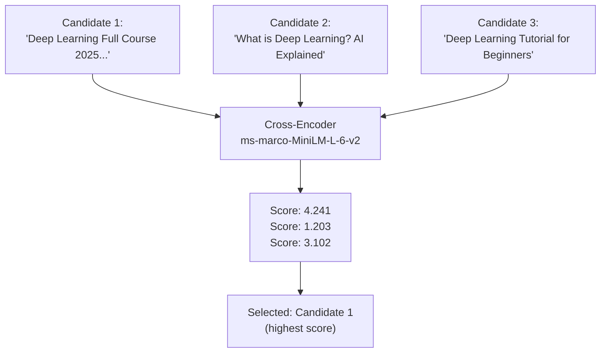

# Cross-Encoder Resource Ranking & Dynamic Scraping (v2.0)

The final stage of the PathInferenceEngine transforms abstract topic names into concrete, high-quality learning materials. It combines a **zero-dependency YouTube scraper** with a **Cross-Encoder transformer model** for semantic relevance ranking.

---

## 1. Zero-Dependency YouTube Scraping

Instead of relying on API keys (YouTube Data API v3) or third-party libraries, we use Python's native `urllib` to fetch YouTube search results.

### The Retrieval Process
1. **Semantic Query Construction:** For topic "React JS", generate: `"React JS full course tutorial"`
2. **Type Filtering:** Append YouTube's `sp=EgIQAQ` parameter to force **long-form video** results
3. **Multi-Candidate Extraction:** Extract up to **5 video candidates** with titles using regex on the JSON-embedded page data


---

## 2. Cross-Encoder Semantic Ranking (The Key Innovation)

### Before (v1.0): First Result Wins
The old system took the first YouTube result and fell back to a **hardcoded video ID** (`xk4_1vCGkdQ`) on failure.

### After (v2.0): Model-Ranked Selection
All 5 candidates are scored by a **Cross-Encoder** (`cross-encoder/ms-marco-MiniLM-L-6-v2`):



### How Cross-Encoders Work
Unlike bi-encoders (which encode query and document separately), a **Cross-Encoder** processes the `(query, document)` pair **together** through a single BERT pass:

$$\text{relevance}(q, d) = \text{CrossEncoder}([q; d])$$

This captures fine-grained interactions between the topic and video title, producing more accurate relevance scores.

### Real Scoring Example
```
Topic: 'Convolutional Neural Networks'
  Candidate 1: 'CNN Tutorial | How CNN Works | Simplilearn'     → Score: 7.504 ✓
  Candidate 2: 'Deep Learning Crash Course'                     → Score: 3.102
  Candidate 3: 'Neural Networks Explained'                      → Score: 4.891
  Candidate 4: 'Python for Data Science'                        → Score: -0.312
  Candidate 5: 'Machine Learning Basics'                        → Score: 1.024
```

The Cross-Encoder correctly identifies the most specific, relevant tutorial.

---

## 3. No Hardcoded Fallbacks

| Scenario | Before (v1.0) | After (v2.0) |
|:---|:---|:---|
| YouTube returns results | Take first result | Cross-Encoder picks best of 5 |
| YouTube scraping fails | Return `"xk4_1vCGkdQ"` (hardcoded) | Return `null` → frontend shows "No video available" placeholder |
| Single candidate only | Take it directly | Still score it (relevance_score field populated) |

---

## 4. Caching & Performance

### Memory-Optimized Cache
The `_yt_cache` dict stores `(video_id, relevance_score)` per topic:
*   First request for "Python Basics": ~2-3s (HTTP fetch + CrossEncoder scoring)
*   Second request: **0μs** (served from RAM)

### Model Loading
The Cross-Encoder (`~80MB`) is downloaded once from HuggingFace Hub and cached at `~/.cache/huggingface/`. Subsequent startups load from disk in ~3s.

---

## 5. Implementation Details

*   **File:** [sequence_optimizer.py](../../app/engine/sequence_optimizer.py)
*   **Class:** `SequenceOptimizer`
*   **Key Methods:**
    *   `_fetch_youtube_candidates(topic, max_results=5)` → `List[(video_id, title)]`
    *   `rank_and_select(topic)` → `(best_video_id, relevance_score)` or `(None, None)`
    *   `enrich_roadmap(subgraph, ordered_nodes, readiness_scores, priorities)` → final JSON
