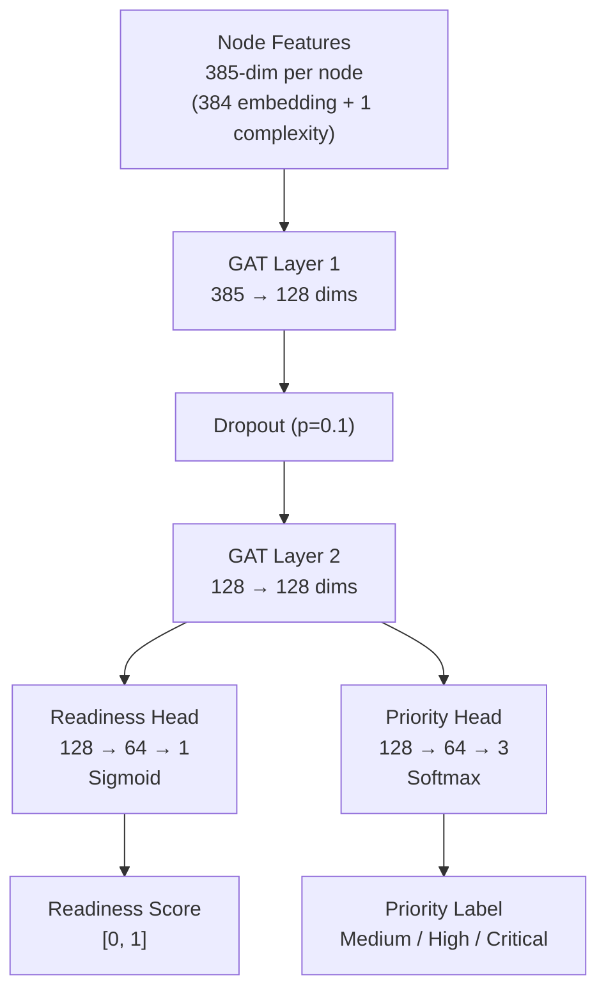

# Graph Neural Network Sequencer

The GNN Sequencer is the most novel ML component of the PathInferenceEngine. It replaces hardcoded `if complexity >= 8: "Critical"` logic with a **learned model** that predicts both **readiness scores** (what to learn first) and **priority classification** (how important each topic is).

---

## 1. Architecture: 2-Layer Graph Attention Network (GAT)

Built in **pure PyTorch** with no `torch_geometric` dependency. The curriculum graph is small (~39 nodes), so a hand-rolled message-passing implementation is both sufficient and dependency-free.



### Graph Attention Layer (GAT)

Each GAT layer performs **attention-based message passing**:

1. **Transform:** Project node features: $Wh_i$ for each node $i$
2. **Attend:** Compute pairwise attention scores: $e_{ij} = \text{LeakyReLU}(a^T [Wh_i \| Wh_j])$
3. **Mask:** Zero out non-edges (only neighbors contribute)
4. **Normalize:** Softmax over valid neighbors: $\alpha_{ij} = \text{softmax}_j(e_{ij})$
5. **Aggregate:** Weighted sum: $h'_i = \text{ELU}\left(\sum_j \alpha_{ij} \cdot Wh_j\right)$

### Dual Output Heads
*   **Readiness Head:** `Linear(128→64) → ReLU → Linear(64→1) → Sigmoid`
    *   Output: score in [0, 1] — higher means "learn this topic sooner"
*   **Priority Head:** `Linear(128→64) → ReLU → Linear(64→3)`
    *   Output: logits for 3-class classification (Medium, High, Critical)

---

## 2. Self-Supervised Pre-Training

The GNN is trained **at startup** without any labeled data. The training signal comes from the graph's own structure.

### Training Signals

| Signal | Source | What It Teaches |
|:---|:---|:---|
| **Readiness targets** | Topological ordering | Prerequisite nodes should be learned before advanced nodes |
| **Priority targets** | Node complexity values | Complexity ≥ 8 = Critical, ≥ 5 = High, < 5 = Medium |

### Readiness Target Computation
```python
topo_order = list(nx.topological_sort(graph))
for i, node in enumerate(topo_order):
    target_readiness[node] = 1.0 - (i / (num_nodes - 1))
```
Nodes earlier in topological sort get higher readiness targets. The GNN learns to predict this ordering from the graph structure and node features.

### Loss Function
$$\mathcal{L} = \text{MSE}(\hat{r}, r^*) + 0.5 \cdot \text{CrossEntropy}(\hat{p}, p^*)$$

Where $\hat{r}$ = predicted readiness, $r^*$ = target readiness, $\hat{p}$ = predicted priority logits, $p^*$ = target priority labels.

### Training Results
```
Epoch 100/300 | Loss: 0.0306 (readiness: 0.0119, priority: 0.0376)
Epoch 200/300 | Loss: 0.0069 (readiness: 0.0057, priority: 0.0026)
Epoch 300/300 | Loss: 0.0027 (readiness: 0.0021, priority: 0.0011)
```

Loss converged to **0.0027** — the model learned both topological ordering and complexity-based priority from structure alone.

---

## 3. Subgraph Inference (The Key Insight)

The GNN is **pre-trained on the full graph** but runs **inference on user-specific subgraphs**.

### Why This Matters
*   User A wants "Deep Learning" and knows "Python" → subgraph has 4 nodes
*   User B wants "Cloud Architecture" and knows nothing → subgraph has 12 nodes
*   The **same model** produces different predictions for each because the subgraph structure is different
*   Nodes that are bottlenecks in one subgraph (high in-degree) get different attention weights than in another

### Example
```
Full graph GNN readiness for "Deep Learning": 0.58
Subgraph after removing known skills: 0.62 (higher — it's now closer to a root)
```

The GNN naturally adapts to what the user already knows, without needing an explicit "known" flag.

---

## 4. Why Not `torch_geometric`?

| Factor | torch_geometric | Hand-rolled GAT |
|:---|:---|:---|
| **Dependencies** | torch_scatter, torch_sparse, torch_cluster | None (pure PyTorch) |
| **Install complexity** | 5+ packages with C++ compilation | `pip install torch` |
| **Graph size** | Designed for millions of nodes | 39 nodes (trivial) |
| **Performance** | Optimized sparse operations | Dense attention (fast enough at N=39) |
| **Customization** | API constraints | Full control over attention + aggregation |

For a 39-node graph, the overhead of `torch_geometric` is not justified. Dense attention on a 39×39 adjacency matrix computes in microseconds.

---

## 5. Implementation Details

*   **File:** [gnn_sequencer.py](../../app/engine/gnn_sequencer.py)
*   **Classes:**
    *   `GraphAttentionLayer` — Single GAT layer with pairwise attention
    *   `GNNSequencer` — 2-layer GAT model with readiness + priority heads
    *   `GNNTrainer` — Self-supervised training loop + subgraph tensor builder
*   **Key Methods:**
    *   `GNNSequencer.predict(features, adj)` → `(readiness_scores, priority_labels)`
    *   `GNNTrainer.train(features, adj, target_readiness, target_priority, epochs)`
    *   `GNNTrainer.build_subgraph_tensors(subgraph, embeddings, node_list)` → `(features, adj)`
