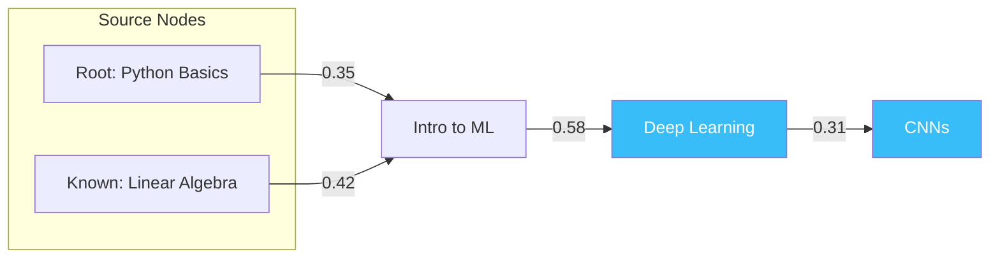

# Knowledge Graph & Dijkstra Pathfinding (v2.0)

While NLP finds the *goal*, the **Knowledge Graph** finds the **optimal path**. We use graph theory with **model-derived edge weights** and **Dijkstra's algorithm** to discover the cheapest cognitive route.

---

## 1. Directed Acyclic Graphs (DAG)

Our curriculum is modeled as a **DAG** using NetworkX's `DiGraph`:
*   **Directed:** Logic flows from prerequisite → advanced topic.
*   **Acyclic:** No circular dependencies. You cannot need "A" before "B" while needing "B" before "A".
*   **39 nodes, 42 edges** in the current curriculum.

---

## 2. Embedding-Weighted Edges (The Key Innovation)

### Before (v1.0): Blind Ancestor Collection
The old system used `nx.ancestors()` which collects **every single prerequisite** regardless of relevance:
```
Target: Deep Learning → Collected: ML, Calculus, Statistics, NumPy, Python, Linear Algebra (6 nodes)
```

### After (v2.0): Dijkstra with Learned Weights
Each edge has a weight computed from **two model-derived signals**:

$$w(u, v) = \alpha \cdot \frac{|c_v - c_u|}{10} + \beta \cdot (1 - \cos(e_u, e_v))$$

Where:
*   $c_u, c_v$ = complexity scores of source and target nodes
*   $e_u, e_v$ = 384-dim sentence-transformer embeddings
*   $\cos(e_u, e_v)$ = cosine similarity from normalized dot product

**Interpretation:**
*   **Semantically similar adjacent topics** (e.g., "React JS" → "Advanced React") have low semantic distance → **cheap edge**
*   **Big complexity jumps** (e.g., complexity 1 → complexity 8) → **expensive edge**
*   Dijkstra naturally avoids expensive detours and finds the path that minimizes total cognitive load

### Example Edge Weights
| Edge | Δcomplexity | Cosine Sim | Weight |
|:---|:---|:---|:---|
| React JS → Advanced React | 0.20 | 0.85 | 0.35 (cheap) |
| Python Basics → Cryptography | 0.70 | 0.12 | 1.58 (expensive) |

---

## 3. Dijkstra Pathfinding

For each target node, the system finds the **shortest-weight path** from any source node:



**Source nodes** = graph roots (no prerequisites) ∪ user-known nodes.

Dijkstra explores all paths and returns the cheapest one: `Linear Algebra → ML → DL → CNNs` (if that's cheaper than going through Python → NumPy → ML → DL → CNNs).

---

## 4. Embedding-Based Skill Matching

User skills like `"Python"` are matched to graph nodes via **cosine similarity**, not substring matching:

```
[Skill Match] 'Python'         -> python_basics  (sim: 0.818)
[Skill Match] 'Linear Algebra' -> linear_algebra (sim: 1.000)
```

Threshold: similarity ≥ 0.40 required for a match. This means "I know OOP" can match "Python Basics" even though the strings share no characters.

---

## 5. Implementation Details

*   **File:** [knowledge_graph.py](../../app/engine/knowledge_graph.py)
*   **Class:** `KnowledgeGraph`
*   **Key Methods:**
    *   `find_optimal_paths(target_nodes, known_nodes)` — Dijkstra pathfinding
    *   `match_skills_to_nodes(skill_strings)` — Embedding-based skill matching
    *   `_compute_edge_weight(source, target)` — Model-derived edge costs
