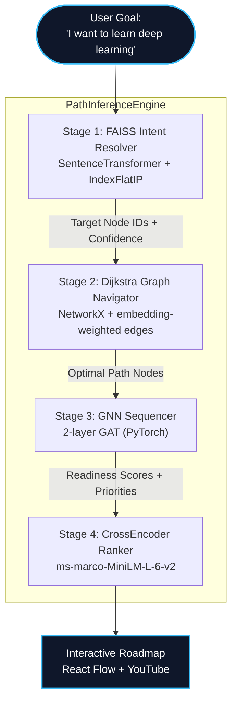

# AI/ML Architecture: The Recommendation Pipeline (v2.0)

The AI Learning Architect utilizes a **5-model ML pipeline** to transform an unstructured user goal into an optimally-sequenced, multimedia learning roadmap. Every routing decision is model-driven — no hardcoded paths remain.

---

## The 4-Stage LangGraph Pipeline

The "Brain" of the platform is a **LangGraph StateGraph** with typed state flowing through 4 inference stages, powered by 5 distinct ML models.

### Stage 1: FAISS Intent Resolver
*   **Model:** `all-MiniLM-L6-v2` (Sentence-Transformers) + FAISS `IndexFlatIP`
*   **Purpose:** Encodes the user's free-text goal into a 384-dim vector and finds the closest curriculum topics via cosine similarity. Returns `(node_id, topic_name, confidence_score)` tuples.
*   **Key design:** Uses inner-product on L2-normalized embeddings = cosine similarity. Dynamic threshold at 80% of top score.

### Stage 2: Dijkstra Graph Navigator
*   **Technology:** NetworkX DiGraph with **learned edge weights**
*   **Edge weight formula:** `|Δcomplexity| + (1 - cosine_similarity(source_embedding, target_embedding))`
*   **Purpose:** Finds the shortest weighted path from root nodes (or user-known nodes) to target nodes. Semantically similar adjacent topics have cheaper transitions. User skills are embedding-matched to nodes via cosine similarity (not substring matching).

### Stage 3: GNN Sequencer
*   **Model:** 2-layer Graph Attention Network (pure PyTorch, no torch_geometric)
*   **Input:** 385-dim node features (384 embedding + 1 normalized complexity)
*   **Output:** Per-node readiness score [0, 1] + priority classification (Medium/High/Critical)
*   **Training:** Self-supervised on topological ordering + complexity. Re-trains on every startup in ~2s.

### Stage 4: CrossEncoder Resource Ranker
*   **Model:** `cross-encoder/ms-marco-MiniLM-L-6-v2`
*   **Purpose:** Fetches 5 YouTube candidates per topic, scores each `(topic, video_title)` pair, selects the highest-scoring tutorial. No hardcoded fallback — returns `null` if no candidates found.

---

## Detailed Technical Deep-Dives

1. [NLP & Semantic Intent](NLP_SEMANTIC_INTENT.md)
2. [Vector Indexing & FAISS](VECTOR_INDEXING.md)
3. [Knowledge Graphs & Dijkstra Pathfinding](GRAPH_THEORY_TOPOLOGY.md)
4. [GNN Sequencer](GNN_SEQUENCER.md)
5. [Cross-Encoder Resource Ranking](DYNAMIC_SCRAPING_ENGINE.md)
