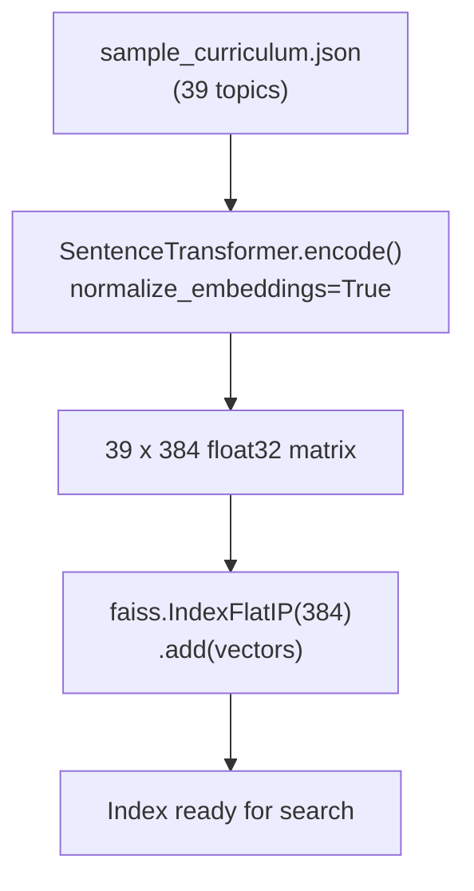

# Vector Indexing: FAISS for Semantic Retrieval (v2.0)

To handle curriculum matching efficiently, the system uses **FAISS** (Facebook AI Similarity Search) — a library for sub-millisecond similarity search in high-dimensional vector spaces.

---

## 1. Why FAISS?

Standard SQL queries search for exact text (e.g., `WHERE topic = 'Python'`). This is brittle. If a user says "I know OOP", a SQL database doesn't understand that this maps to "Python Basics" or "Java Basics".

**Vector Search** finds nodes based on **contextual meaning** — "OOP" and "Python Basics" are close in the embedding space because they are discussed in similar contexts across the internet.

### Performance
*   **Speed:** FAISS is written in C++ and optimized for sub-millisecond searches on millions of vectors.
*   **Our scale:** 39 curriculum topics × 384 dimensions = trivial. Searches complete in microseconds.

---

## 2. Why `IndexFlatIP` Instead of `IndexFlatL2`?

We use **IndexFlatIP** (Inner Product) instead of the more common **IndexFlatL2** (Euclidean Distance).

### The Reason
Our embeddings are **L2-normalized** (unit vectors). For unit vectors:

$$\text{cosine\_similarity}(A, B) = A \cdot B = \text{inner\_product}(A, B)$$

This means:
*   **IndexFlatIP** directly computes cosine similarity (higher = more similar)
*   **IndexFlatL2** computes Euclidean distance (lower = more similar)

Both give equivalent results for normalized vectors, but `IndexFlatIP` returns scores in the intuitive [0, 1] range, making threshold tuning easier.

---

## 3. The Indexing Process

At startup, the `IntentParser` builds a FAISS index over all curriculum topics:



### Retrieval Logic
For each query, we retrieve the **top 3** nearest neighbors:
```python
scores, indices = self._index.search(query_embedding, top_k=3)
```

Then apply dynamic thresholding (80% of top score, minimum 0.20) to filter results.

---

## 4. Dual Usage of Embeddings

The same sentence-transformer embeddings serve **two purposes**:

| Usage | Component | Purpose |
|:---|:---|:---|
| **Intent Resolution** | `IntentParser` | Match user goals to curriculum node IDs |
| **Edge Weight Calculation** | `KnowledgeGraph` | Compute semantic distance between connected topics for Dijkstra |
| **Skill Matching** | `KnowledgeGraph` | Match user-provided skill strings to graph nodes |

This is why the model is loaded once and shared — one `SentenceTransformer` instance, three consumers, minimal RAM.

---

## 5. Implementation Details

*   **File:** [intent_parser.py](../../app/engine/intent_parser.py)
*   **Index type:** `faiss.IndexFlatIP` (exact inner-product search)
*   **Build method:** `IntentParser.build_index(data_path)`
*   **Search method:** `IntentParser.resolve_intent(goal, top_k=3)`

### Safety Guards
*   Query embeddings are forced to `np.float32` and 2D shape `(1, 384)` before FAISS search.
*   `-1` sentinel indices from FAISS (no match) are filtered out.
*   If nothing passes the dynamic threshold, the single best match is always returned.
