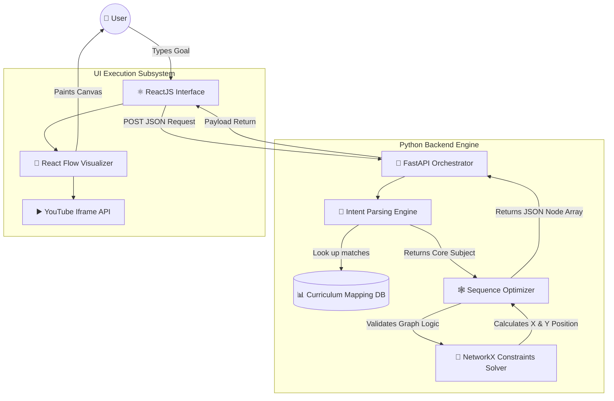
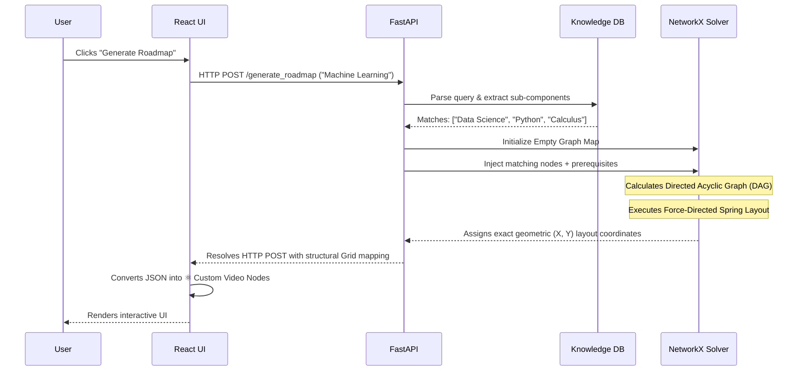

# AI Learning Architect: Technical Architecture

This document breaks down the systems, databases, and application pipelines governing the Autonomous AI Learning Architect platform.

## High-Level System Architecture

The following diagram illustrates exactly how the application manages data from the moment a user clicks "Generate" to the moment the UI physically renders a multi-media path.

***

## API Sequence Logic

The Sequence Diagram dictates the exact multi-step chronological flow of server actions. Unlike traditional web applications that fetch from databases linearly, this application must solve a mathematical topological puzzle before replying seamlessly to the user.

***

## Core Technology Stack Breakdown

### 1. Frontend Wing
* **ReactJS**: The core UI library handling memory state management, button tracking, and component life-cycles dynamically.
* **Vite**: The exceedingly fast HMR (Hot Module Replacement) bundler used instead of Webpack. It compiles React code natively during development seamlessly.
* **React Flow (XYFlow)**: A specialized node-routing library mathematically tracking the user's viewport panning, zoom limits, and node edges generated by the backend.

### 2. Backend Orchestration
* **Python 3.12+**: Foundation language chosen specifically for its scientific computing ecosystem which React/NodeJS severely lack natively.
* **FastAPI**: Extremely modern ASGI routing engine ensuring requests are handled at production-level C-like speeds strictly using Pydantic typing validations.
* **NetworkX**: The absolute central pivot for logic. Rather than plotting linearly, NetworkX processes graph topologies iteratively forcing prerequisite topics physically above advanced topics.

### 3. Data Infrastructure
* **JSON/JSONLines**: Serving as local rapid-testing dictionaries to securely keep application data loaded statically within RAM instead of managing standard latency network database constraints.
